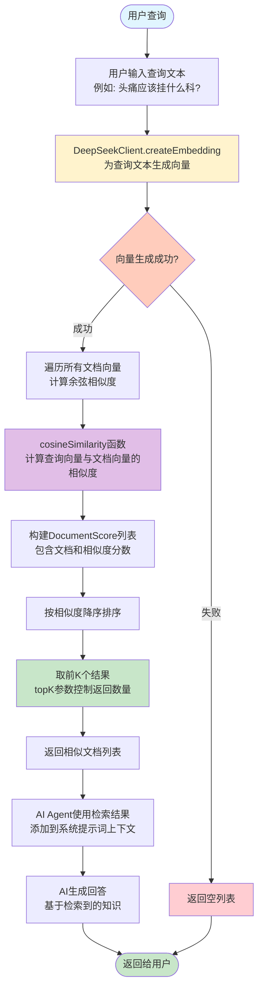
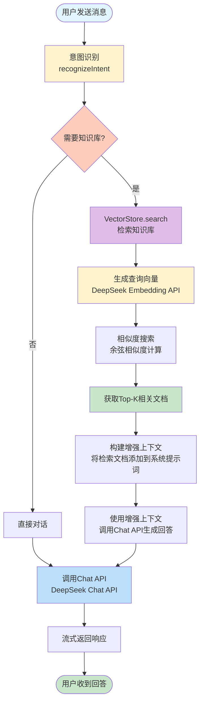
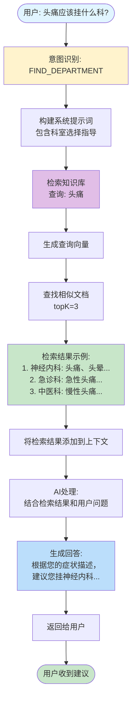
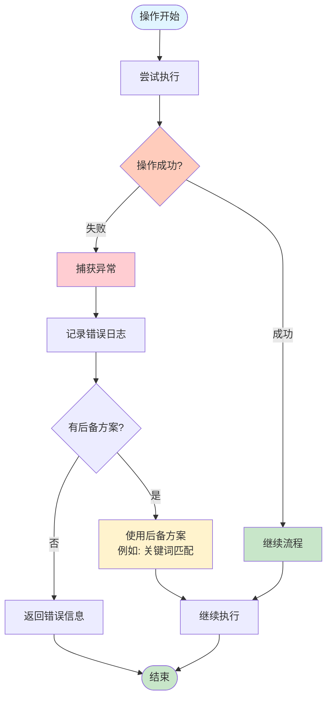

# 知识库检索流程图

## 1. 知识库初始化流程

```mermaid
flowchart TD
    Start([系统启动]) --> Init[KnowledgeBaseService.init<br/>@PostConstruct]
    Init --> LoadDept[加载科室介绍数据]
    LoadDept --> LoadPolicy[加载就诊须知数据]
    LoadPolicy --> LoopStart{遍历文档}
    
    LoopStart --> AddDoc[VectorStore.addDocument<br/>添加文档到向量库]
    AddDoc --> GenEmbedding[DeepSeekClient.createEmbedding<br/>调用Embedding API生成向量]
    GenEmbedding --> CheckSuccess{生成成功?}
    
    CheckSuccess -->|成功| StoreEmbedding[存储向量到embeddings Map]
    CheckSuccess -->|失败| LogError[记录错误日志<br/>文档仍保留但无向量]
    
    StoreEmbedding --> NextDoc{还有文档?}
    LogError --> NextDoc
    
    NextDoc -->|是| LoopStart
    NextDoc -->|否| Complete[初始化完成<br/>记录文档总数]
    
    Complete --> End([知识库就绪])
    
    style Start fill:#e1f5ff
    style End fill:#c8e6c9
    style GenEmbedding fill:#fff3cd
    style CheckSuccess fill:#ffccbc
    style LogError fill:#ffcdd2
```

### 初始化流程说明

**步骤详解：**
1. **系统启动**：Spring容器启动时，`@PostConstruct`注解触发知识库初始化
2. **加载数据**：从代码中加载科室介绍和就诊须知数据
3. **文档处理**：为每个文档执行以下操作：
   - 生成唯一ID（UUID）
   - 添加到文档列表
   - 调用Embedding API生成向量
   - 存储向量到内存Map中
4. **容错处理**：如果向量生成失败，记录错误但保留文档

---

## 2. 知识库检索流程（RAG）



### 检索流程说明

**核心步骤：**
1. **查询向量化**：将用户查询文本转换为向量表示
2. **相似度计算**：使用余弦相似度计算查询向量与所有文档向量的相似度
3. **排序筛选**：按相似度降序排序，返回最相关的topK个文档
4. **上下文增强**：将检索到的文档添加到AI的上下文中，实现RAG（检索增强生成）

---

## 3. 完整RAG流程（检索增强生成）



### RAG流程说明

**RAG（Retrieval-Augmented Generation）优势：**
- **准确性**：基于真实知识库内容，减少幻觉
- **时效性**：可以更新知识库而不需要重新训练模型
- **可解释性**：可以追踪答案来源

---

## 4. 向量相似度计算详解

```mermaid
flowchart TD
    Start([开始计算相似度]) --> Input[输入: 查询向量A<br/>文档向量B]
    Input --> CheckDim{向量维度相同?}
    
    CheckDim -->|否| ReturnZero[返回0.0]
    CheckDim -->|是| DotProduct[计算点积<br/>dotProduct = Σ(A[i] × B[i])]
    
    DotProduct --> NormA[计算向量A的模<br/>normA = √(Σ(A[i]²))]
    NormA --> NormB[计算向量B的模<br/>normB = √(Σ(B[i]²))]
    
    NormB --> Cosine[计算余弦相似度<br/>similarity = dotProduct / (normA × normB)]
    Cosine --> Normalize[结果范围: -1 到 1<br/>1表示完全相同<br/>0表示正交<br/>-1表示完全相反]
    
    Normalize --> Return[返回相似度分数]
    ReturnZero --> Return
    Return --> End([完成])
    
    style Start fill:#e1f5ff
    style CheckDim fill:#ffccbc
    style DotProduct fill:#e1bee7
    style Cosine fill:#c8e6c9
    style End fill:#c8e6c9
    style ReturnZero fill:#ffcdd2
```

### 余弦相似度公式

```
cosine_similarity(A, B) = (A · B) / (||A|| × ||B||)

其中：
- A · B = Σ(A[i] × B[i])  (点积)
- ||A|| = √(Σ(A[i]²))     (向量A的模)
- ||B|| = √(Σ(B[i]²))     (向量B的模)
```

---

## 5. 知识库检索在AI对话中的应用



---

## 6. 关键技术组件

### 6.1 VectorStore（向量存储）
- **功能**：文档存储、向量生成、相似度搜索
- **存储方式**：内存存储（生产环境建议使用专业向量数据库）
- **核心方法**：
  - `addDocument()`: 添加文档并生成向量
  - `search()`: 相似度搜索
  - `cosineSimilarity()`: 余弦相似度计算

### 6.2 DeepSeekClient（API客户端）
- **功能**：调用DeepSeek API
- **支持接口**：
  - `/chat/completions`: 对话API
  - `/embeddings`: 向量生成API
- **共用配置**：使用相同的API Key和基础URL

### 6.3 KnowledgeBaseService（知识库服务）
- **功能**：初始化知识库数据
- **数据来源**：科室介绍、就诊须知
- **初始化时机**：系统启动时自动执行

### 6.4 AiAgentService（AI代理服务）
- **功能**：意图识别、上下文构建、RAG集成
- **工作流程**：
  1. 识别用户意图
  2. 根据意图决定是否检索知识库
  3. 将检索结果添加到上下文
  4. 调用AI生成回答

---

## 7. 性能优化建议

1. **向量数据库**：生产环境使用Milvus、Pinecone等专业向量数据库
2. **缓存机制**：缓存常用查询的向量和结果
3. **批量处理**：批量生成向量，减少API调用
4. **异步处理**：向量生成和检索使用异步方式
5. **索引优化**：使用向量索引加速相似度搜索

---

## 8. 错误处理机制



### 容错策略
- **向量生成失败**：记录错误，文档保留但无向量（搜索时跳过）
- **API调用失败**：记录错误，使用后备方案（关键词匹配）
- **检索无结果**：返回空列表，AI基于通用知识回答

---

## 总结

知识库检索系统通过以下方式实现RAG（检索增强生成）：

1. **初始化阶段**：将知识文档转换为向量并存储
2. **检索阶段**：将用户查询转换为向量，通过相似度搜索找到相关文档
3. **生成阶段**：将检索到的文档作为上下文，让AI生成更准确的回答

这种架构确保了AI回答的准确性和可追溯性，同时保持了系统的灵活性和可扩展性。

