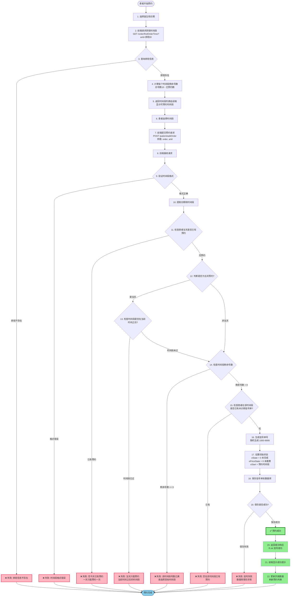
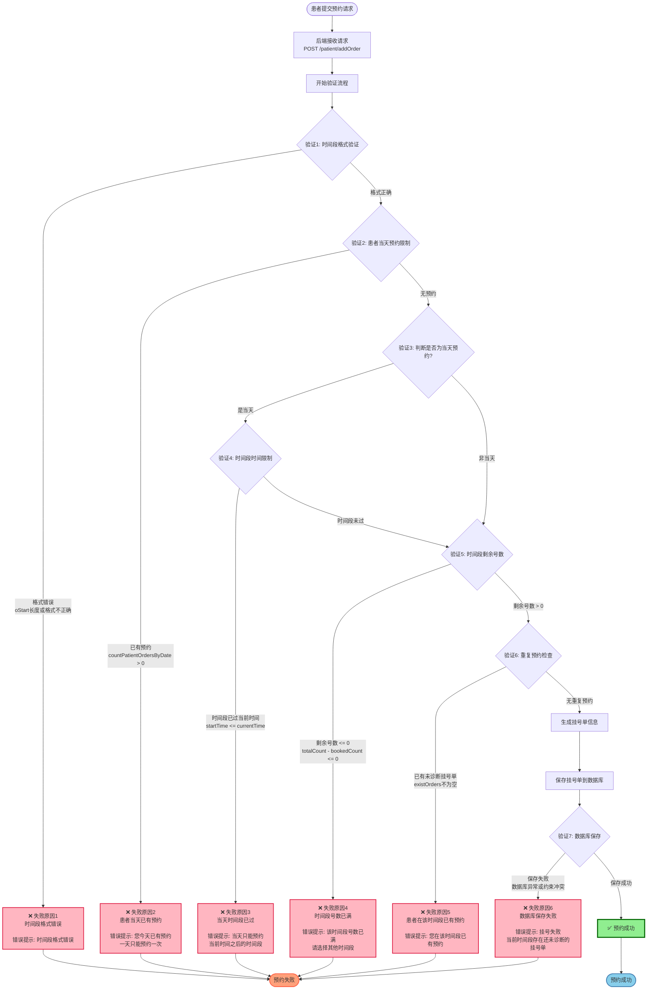
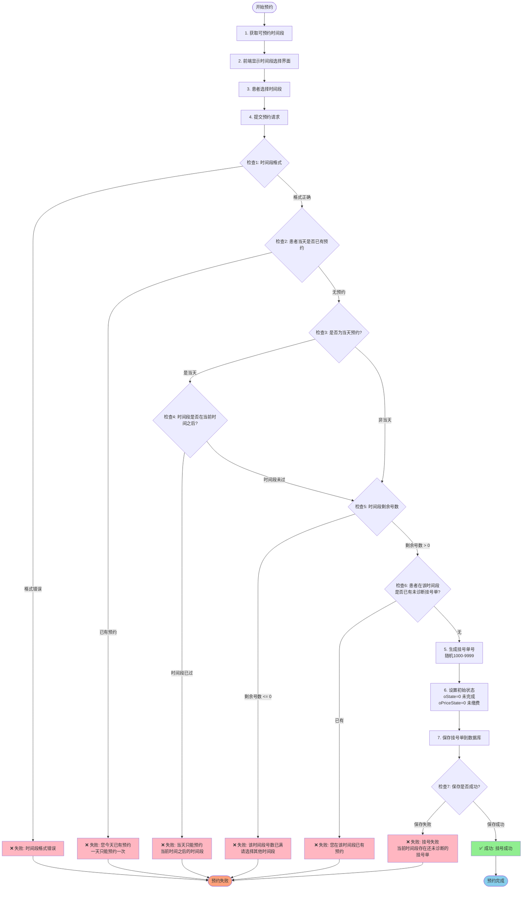

# 预约挂号流程图

## 1. 预约成功流程图

### 预约成功流程说明

**成功路径的关键步骤：**
1. ✅ 时间段格式正确
2. ✅ 患者当天无其他预约
3. ✅ 当天预约时，时间段在当前时间之后
4. ✅ 时间段剩余号数 > 0
5. ✅ 患者在该时间段无未诊断挂号单
6. ✅ 数据库保存成功

**预约成功后的状态：**
- 挂号单号 (oId): 随机生成 1000-9999
- 挂号状态 (oState): 0 (未完成/待就诊)
- 缴费状态 (oPriceState): 0 (未缴费)
- 开始时间 (oStart): 预约的时间段，格式：`yyyy-MM-dd HH:mm-HH:mm`
- 患者ID (pId): 当前登录患者ID
- 医生ID (dId): 选择的医生ID

---

## 2. 预约失败流程图

### 预约失败原因详解

| 失败原因 | 验证检查点 | 验证逻辑 | 错误提示信息 |
|---------|-----------|---------|------------|
| **失败1** | 时间段格式验证 | `oStart` 长度或格式不正确 | 时间段格式错误 |
| **失败2** | 患者当天预约限制 | `countPatientOrdersByDate(pId, date) > 0` | 您今天已有预约，一天只能预约一次 |
| **失败3** | 当天时间段限制 | 当天预约时，`startTime <= currentTime` | 当天只能预约当前时间之后的时间段 |
| **失败4** | 时间段剩余号数 | `totalCount(10) - bookedCount <= 0` | 该时间段号数已满，请选择其他时间段 |
| **失败5** | 重复预约检查 | 患者在该时间段已有 `oState=0` 的挂号单 | 您在该时间段已有预约 |
| **失败6** | 数据库保存 | 保存时发生异常或约束冲突 | 挂号失败，当前时间段存在还未诊断的挂号单 |

### 失败处理机制

所有失败情况都会：
1. 抛出 `RuntimeException` 异常，包含具体的错误信息
2. Controller 层捕获异常并返回 `R.error(错误信息)`
3. 前端接收错误响应并显示错误提示
4. 用户可以根据错误提示调整预约信息后重试

### 关键代码位置

**核心验证方法：**
- `OrderServiceImpl.addOrder(Orders order, String arId)` - 主入口方法
- `OrderServiceImpl.hasPatientOrderToday(Integer pId, String date)` - 检查当天预约
- `OrderServiceImpl.canBookTimeSlot(String timeSlot)` - 检查时间段是否可预约
- `OrderServiceImpl.getRemainingCountForTimeSlot(Integer dId, String date, String timeSlot)` - 获取剩余号数

**数据库查询方法：**
- `OrderMapper.countOrdersByTimeSlot(dId, date, timeSlot)` - 统计时间段预约数
- `OrderMapper.countPatientOrdersByDate(pId, date)` - 统计患者当天预约数

---

## 3. 完整预约流程（包含成功和失败分支）

## 4. 预约验证检查点详解

### 验证检查点列表

| 检查点 | 验证内容 | 失败原因 | 错误提示 |
|--------|---------|---------|---------|
| 检查1 | 时间段格式验证 | 时间段格式不正确 | 时间段格式错误 |
| 检查2 | 患者当天预约限制 | 患者当天已有预约 | 您今天已有预约，一天只能预约一次 |
| 检查3 | 判断是否为当天预约 | - | - |
| 检查4 | 当天时间段限制 | 时间段已过当前时间 | 当天只能预约当前时间之后的时间段 |
| 检查5 | 时间段剩余号数 | 剩余号数 <= 0 | 该时间段号数已满，请选择其他时间段 |
| 检查6 | 重复预约检查 | 患者在该时间段已有未诊断挂号单 | 您在该时间段已有预约 |
| 检查7 | 数据库保存 | 保存失败 | 挂号失败，当前时间段存在还未诊断的挂号单 |

## 5. 预约成功后的状态

### 挂号单初始状态
- **挂号单号 (oId)**: 随机生成 1000-9999
- **挂号状态 (oState)**: 0 (未完成/待就诊)
- **缴费状态 (oPriceState)**: 0 (未缴费)
- **开始时间 (oStart)**: 预约的时间段，格式：`yyyy-MM-dd HH:mm-HH:mm`
- **结束时间 (oEnd)**: null (就诊完成后才设置)
- **患者ID (pId)**: 当前登录患者ID
- **医生ID (dId)**: 选择的医生ID

### 后续流程
1. **待就诊阶段**: 患者等待就诊时间
2. **就诊阶段**: 医生进行诊断，更新挂号单信息
3. **完成就诊**: 设置 `oState = 1`，`oEnd = 当前时间`
4. **缴费阶段**: 患者缴费，设置 `oPriceState = 1`

## 6. 关键代码逻辑位置

### 核心方法
- **获取时间段**: `OrderServiceImpl.findOrderTime(String arId)`
- **添加挂号**: `OrderServiceImpl.addOrder(Orders order, String arId)`
- **计算剩余号数**: `OrderServiceImpl.calculateTimeSlots(Integer dId, String date)`
- **检查当天预约**: `OrderServiceImpl.hasPatientOrderToday(Integer pId, String date)`
- **检查时间段**: `OrderServiceImpl.canBookTimeSlot(String timeSlot)`
- **获取剩余号数**: `OrderServiceImpl.getRemainingCountForTimeSlot(Integer dId, String date, String timeSlot)`

### 数据库查询
- **统计时间段预约数**: `OrderMapper.countOrdersByTimeSlot(dId, date, timeSlot)`
- **统计患者当天预约数**: `OrderMapper.countPatientOrdersByDate(pId, date)`

